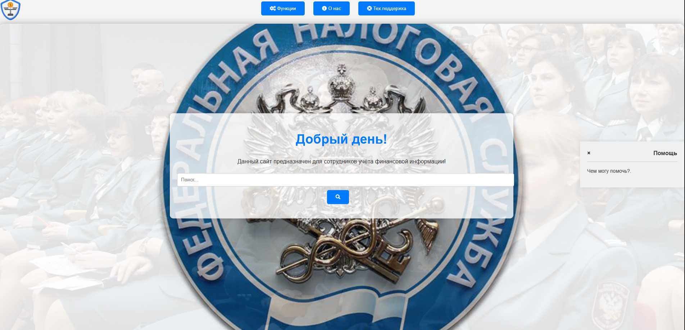
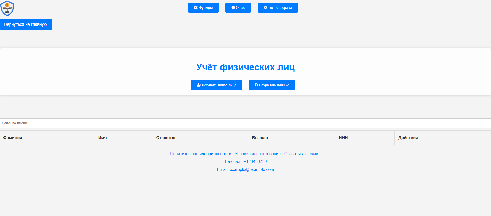
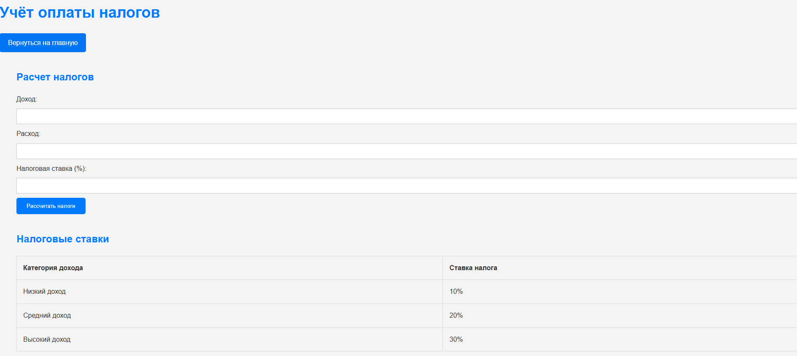
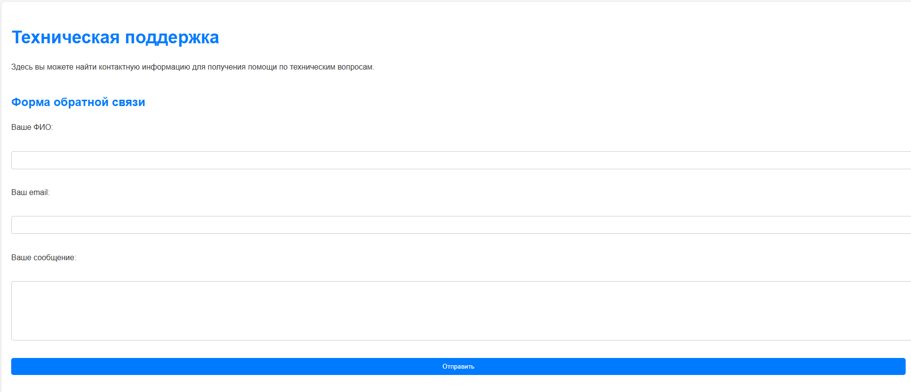

# 🏛️ Tax Office System

**Программный комплекс учёта физических лиц в Налоговой инспекции.**

Веб-приложение для автоматизации процессов сбора, обработки и анализа 
данных о налогоплательщиках.

> 🎓 Курсовая работа по специальности «Информационные системы и программирование».
> Автор: Чертков Артём Альбертович, 2024 г.

---

## ✨ Возможности

### 👤 Учёт физических лиц
- ✅ Добавление новых налогоплательщиков (ФИО, возраст, ИНН)
- ✅ Просмотр карточки
- ✅ Редактирование и удаление
- ✅ Сохранение и обновление в базе

### 💰 Учёт оплаты налогов
- ✅ Расчёт налогов на основе дохода, расхода и ставки
- ✅ Справочник налоговых ставок (10%, 20%, 30%)
- 🟡 Формирование налогового отчёта — *в разработке*
- 🟡 Экспорт в PDF — *в разработке*

### 📧 Отправка уведомлений
- ✅ Форма отправки email
- ✅ Указание темы и текста

### ℹ️ Информационные страницы
- ✅ **О нас**
- ✅ **Техподдержка** — форма готова, отправка в разработке

---

## ⚠️ Статус разработки

Некоторые модули находятся в стадии доработки:

- 🟡 **Отправка налогового отчёта** — интерфейс готов, функция в разработке.
- 🟡 **Форма обратной связи (Техподдержка)** — интерфейс готов, отправка в разработке.

Все остальные функции работают полностью.

## 🛠️ Стек технологий

- **Frontend:** HTML5, CSS3, JavaScript (ES6+)
- **UI:** Font Awesome (иконки)
- **Среда разработки:** VS Code
- **Экспорт:** PDF (через печать браузера)

---

## 🏗️ Архитектура

Приложение построено по **клиент-серверной** модели:

```
┌──────────────────────┐         ┌──────────────────────┐
│      Клиент          │ ◄─────► │      Сервер          │
│  (HTML, CSS, JS)     │         │  (бизнес-логика)     │
└──────────────────────┘         └──────────┬───────────┘
                                            │
                                 ┌──────────▼───────────┐
                                 │      База данных     │
                                 │   (налогоплательщики)│
                                 └──────────────────────┘
```

Каждый модуль независим и может быть расширен без изменения остальных.
## 🚀 Как запустить

### Способ 1. Открыть локально

1. Скачай репозиторий:
   - **Code** → **Download ZIP**.
   - Распакуй архив.
2. Открой файл **`index.html`** в браузере.
3. Готово.

### Способ 2. Через Live Server (для разработки)

1. Открой папку проекта в VS Code.
2. Установи расширение **Live Server**.
3. Правой по `index.html` → **Open with Live Server**.

### 🌐 Живая демонстрация

🔗 **[Открыть сайт](https://0aid0.github.io/tax-office-system/)**

---

## 📸 Скриншоты

### Главный экран


### Учёт физических лиц


### Учёт оплаты налогов


### Техническая поддержка


## 🎓 Чему я научился

- Проектирование клиент-серверной архитектуры
- Разработка SPA-приложения на чистом JavaScript
- Работа с формами, валидация данных
- Реализация CRUD-операций (создание, чтение, обновление, удаление)
- Экспорт данных в PDF
- Тестирование и отладка веб-приложения

---

## 📫 Контакты

- GitHub: [@0AID0](https://github.com/0AID0)
- Telegram: [@Artem196996](https://t.me/Artem196996)
- Email: it.work1904@list.ru

---

## 📄 Лицензия

MIT License — подробности в файле [LICENSE](LICENSE).

---

<p align="center">
  <i>Курсовая работа, 2024 г. · Дальнегорский индустриально-технологический колледж</i>
</p>
